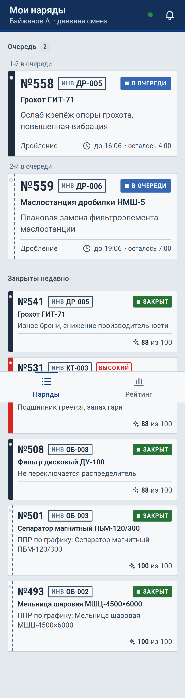
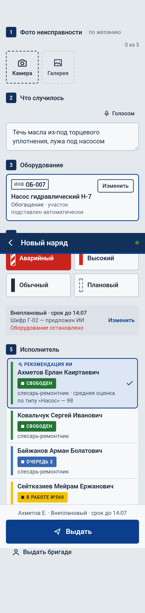
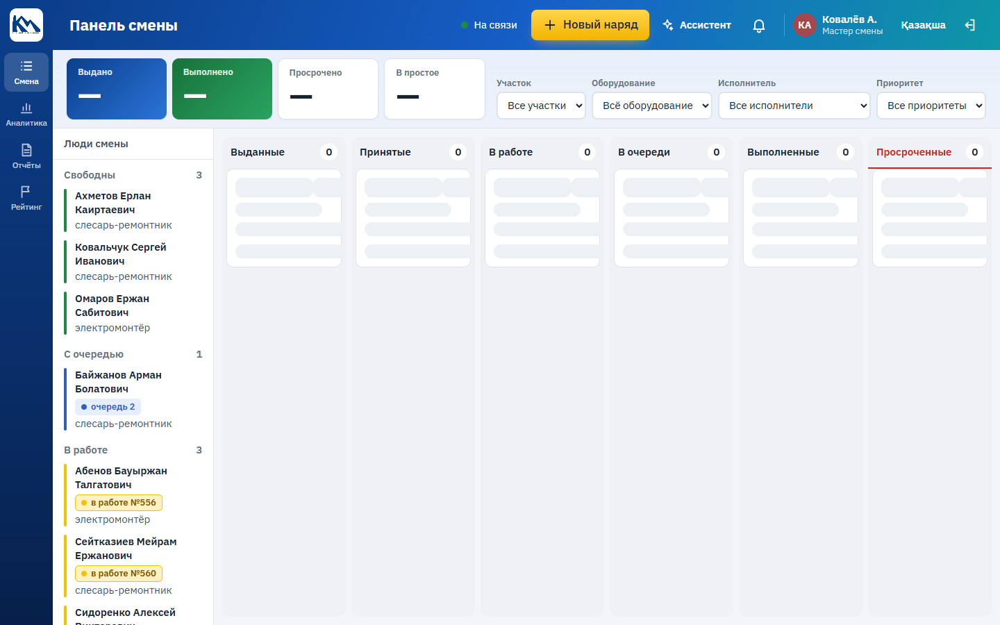
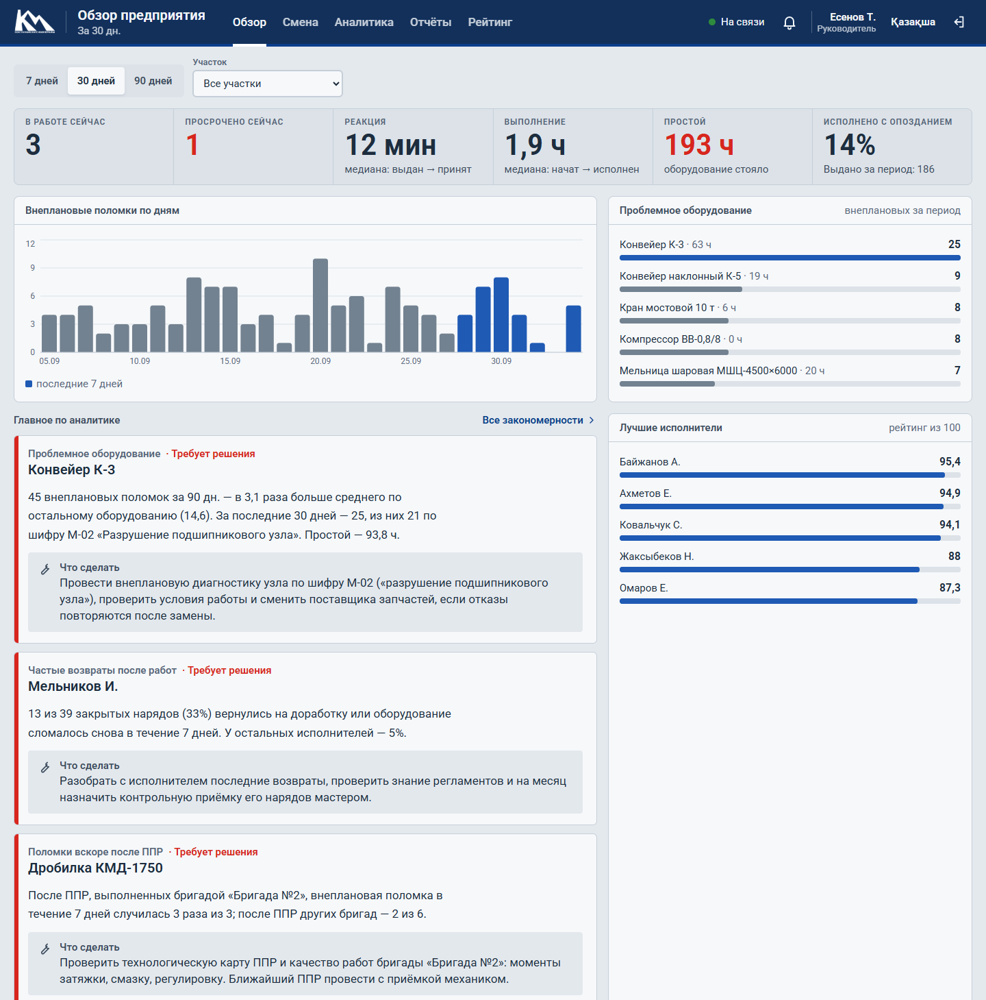
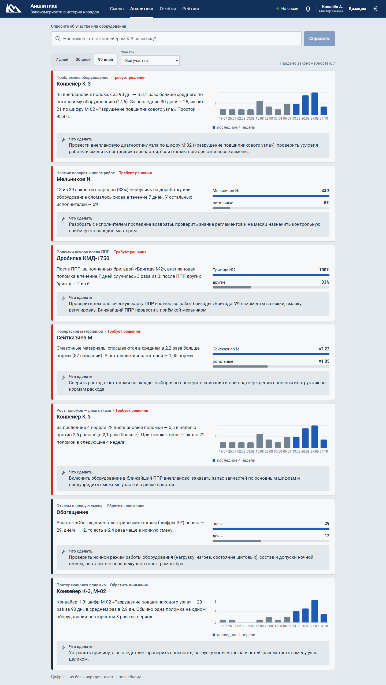
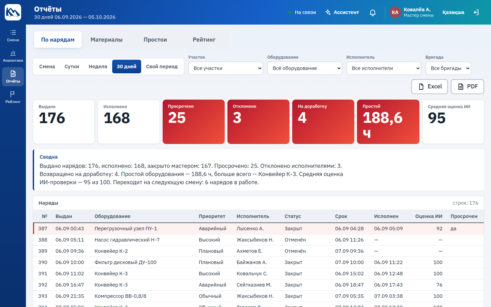
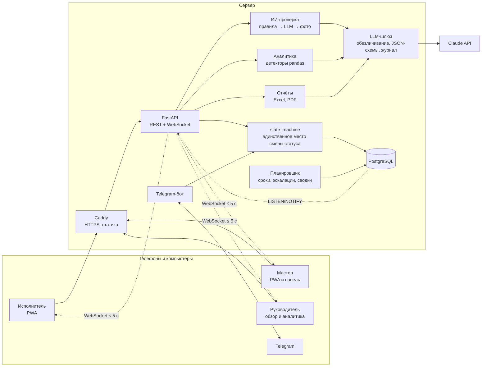

# НарядAI

**Цифровой контролёр смены для ремонтной службы.** Система выдачи и контроля нарядов для АО «Костанайские Минералы» — Qostanai AI Industry Hackathon 2026, кейс 1.

Мастер выдаёт наряд с телефона за 5 нажатий. Исполнитель получает его в Telegram и в приложении, принимает прямо из уведомления, закрывает с работами, шифром, материалами и фото «после». ИИ следит за сроками, проверяет каждое закрытие (правила + языковая модель + сравнение фото «до» и «после»), считает рейтинг, находит закономерности в истории за 3 месяца и пишет отчёты. Финальное слово — всегда за мастером.

| Исполнитель | Мастер с телефона | Панель смены |
|---|---|---|
|  |  |  |

| Обзор руководителя | Аналитика | Отчёты |
|---|---|---|
|  |  |  |

## Запуск

Одной командой (нужен Docker):

```bash
cp .env.example .env
docker compose up -d --build
docker compose exec backend python -m seed
```

Откройте **http://localhost** — вход на экране, учётные записи ниже. API с документацией OpenAPI — http://localhost/api/docs. Пульт демо — http://localhost/demo.

- **Ключ `ANTHROPIC_API_KEY` не обязателен.** Без него ИИ работает на правилах и шаблонах — система полностью рабочая. С ключом проверка закрытия, сравнение фото, выводы аналитики и сводки пишет Claude.
- **Telegram — по желанию:** `TELEGRAM_BOT_TOKEN` и `TELEGRAM_BOT_USERNAME` от @BotFather. Без них уведомления идут в приложение.
- **На сервере** укажите домен в `SITE_ADDRESS` — Caddy сам выпустит HTTPS-сертификат (нужен для камеры и установки PWA на телефон).

Без Docker на Windows (SQLite): `.\tasks.ps1 setup`, `.\tasks.ps1 dev`, `.\tasks.ps1 seed`. На Linux и macOS — те же цели в `Makefile`.

## Учётные записи

| Роль | Логин | ПИН | Что видит |
|---|---|---|---|
| Мастер дневной смены | master1 | 2222 | телефон: выдача и решения; компьютер: панель, аналитика, отчёты |
| Мастер ночной смены | master2 | 2222 | то же |
| Исполнитель | akhmetov (и другие фамилии латиницей) | 1234 | свои наряды, закрытие, рейтинг, профиль |
| Руководитель | boss | 1111 | обзор предприятия, аналитика, отчёты, рейтинг |
| Администратор | admin | 0000 | всё, справочники |

Исполнители: `akhmetov`, `kovalchuk`, `melnikov`, `ismailov`, `sidorenko` (бригада №1), `baizhanov`, `tarasov`, `seitkaziev`, `nurpeisov`, `kim` (бригада №2), `abenov`, `goncharenko`, `omarov`, `lysenko`, `zhaksybekov` (бригада №3). На пульте `/demo` — QR-коды: телефон входит под нужной ролью без ввода ПИН.

## Архитектура



- **Статус наряда меняется только в `state_machine.py`** — таблица переходов из ТЗ; недопустимый переход — понятная ошибка 409. Каждый переход пишет журнал и рассылает событие.
- **Живые обновления** — WebSocket; между процессами (бэкенд, бот, планировщик) — PostgreSQL LISTEN/NOTIFY, без отдельного брокера.
- **Одно SPA на все роли** (React, TypeScript, PWA): `/w` — исполнитель, `/m` — мастер с телефона, `/panel` — рабочее место мастера, `/boss` — руководитель, `/demo` — пульт защиты.
- **REST API с OpenAPI** — точка интеграции с 1С, ERP и ТОиР; в справочниках есть `external_id`, импорт из CSV.

## ИИ-модули

Принцип: **правила находят факты, модель объясняет смысл.** Цифры (сроки, нормы, дубли фото) всегда считает код — воспроизводимо и без галлюцинаций. Все вызовы модели — через один шлюз: ФИО, телефоны и ПИН вырезаются до отправки, ответ строго по JSON-схеме с проверкой, каждый вызов в журнале `llm_calls`. Нет ключа или сбой сети — работают правила, наряд никогда не «зависает».

| Модуль | Как работает |
|---|---|
| **Контроль сроков** (6.1) | Планировщик раз в 30 с: напоминание за 30 мин до срока, просрочка исполнителю и мастеру в формате ТЗ, эскалация непринятого (10 мин, аварийный — 3 мин) с предложением свободного коллеги и кнопкой «Переназначить», повторы, руководителю — после 2 ч просрочки. Аварийный наряд «звонит» каждую минуту, пока не принят. |
| **Проверка закрытия** (6.2) | Полнота, время против норматива и срока, расход против нормы шифра (×1,5 — замечание, ×2,5 — доработка) — правилами; соответствие работ проблеме и уместность материалов — моделью. Итог 0–100 и вердикт; при доработке наряд сразу возвращается исполнителю, иначе ждёт мастера. Результат — за секунды. |
| **Анализ фото** (6.3) | Фото «после» есть, снято во время работ (EXIF), не повторяет старое (pHash по всей базе) и не совпадает с «до». Если есть «до» — мультимодальная модель: то ли оборудование, устранена ли неисправность, аккуратность; балл 1–5. Уверенность ниже 0,6 — решает мастер. |
| **Отчёт по наряду** (6.4) | Исполнителю — балл, что хорошо, что улучшить, время против норматива. Мастеру — всё, включая разбор каждой проверки и фото до/после; мастер подтверждает или меняет оценку с комментарием. |
| **Аналитика** (6.5) | 7 детекторов на pandas с проверкой значимости: проблемное оборудование, возвраты исполнителя, поломки после ППР по бригадам, отказы в ночную смену, перерасход материалов, повтор шифра, рост поломок с прогнозом. Модель пишет вывод и рекомендацию; вопрос свободным текстом («что с К-3 за месяц?»); сводка по понедельникам. |
| **Рейтинг** (6.6) | Качество 35 % · в срок 25 % · без возвратов 20 % · объём с учётом сложности 15 % · без отказов без причины 5 %. От 5 нарядов. Каждому — пояснение «что поднимет сильнее всего». Рейтинг бригад. |
| **Подсказки при выдаче** | Исполнитель: специальность → свободен → оценка по этому типу оборудования → очередь. Шифр неисправности по описанию. Срок — из приоритета и норматива. |

### Качество ИИ-проверки (`make ai-eval`)

30 закрытий размечены вручную: как должен решить контролёр. Среди них хорошие закрытия, без фото, с перерасходом, с работами не по проблеме, с отпиской вместо описания, с фото из другого наряда, с «после» = «до», со снимком до выдачи наряда. Каждый случай проходит весь путь: наряд в базе, фото через медиасервис (EXIF, pHash), фоновая проверка. Проверка точности — в CI.

| Режим | Точность | Время проверки |
|---|---|---|
| Без ключа (правила) | **28 из 30 — 93 %** | в среднем 0,1 с |
| С `ANTHROPIC_API_KEY` (Claude Sonnet 5.5) | запускается той же командой | до 15 с |

Обе ошибки режима без ключа — случаи, видимые только на фото (лужа масла на месте; на снимке другой агрегат). Их ловит сравнение фото моделью.

```
                принято  замечания  доработка
принято              11          0          0
замечания             0          5          0
доработка             2          0         12
```

## Тестовые данные

`python -m seed` детерминированно (seed=42) создаёт справочники в объёме ТЗ (4 участка, 25 единиц оборудования, 20 шифров с нормативами времени и материалов, 40 материалов, 2 мастера и 15 исполнителей в 3 бригадах), историю из 550+ нарядов за 3 месяца с журналом, оценками ИИ, списаниями и простоями, и демо-сцену текущей смены. Пять закономерностей заложены явно — аналитика находит все, это проверяет тест:

```
[OK] Конвейер К-3: 47 внеплановых против среднего 14,8 (в 3,2 раза); за 30 дней — 25, из них М-02 — 21
[OK] Мельников И.: 33% нарядов — доработка или повторная поломка ≤7 дней; у остальных 5%
[OK] КМД-1750: после ППР бригады №2 поломка в течение 5 дней — 3 из 3; после ППР бригады №1 — 0 из 3
[OK] Обогащение, шифры Э-*: ночью 30, днём 12 (в 2,5 раза чаще ночью)
[OK] Сейтказиев М.: смазочные в среднем 2,2 нормы; у остальных — 1,05 нормы
```

## Что сделано по ТЗ

| Требование | Уровень в ТЗ | Статус |
|---|---|---|
| Выдача наряда с телефона за ≤ 6 нажатий, статус исполнителя при выборе | MVP | ✅ 5 нажатий (6 с фото) |
| Панель мастера: люди смены по цветам, канбан, фильтры, счётчики | MVP | ✅ |
| Push с кнопками, аварийный — красным и требует ответа | MVP | ✅ Telegram + полноэкранное оповещение в PWA |
| Действия исполнителя, форма закрытия с фото | MVP | ✅ голосовой ввод, материалы по норме |
| ИИ-контроль сроков, эскалации | MVP | ✅ + руководителю (желательно) |
| ИИ-проверка закрытия, отчёт по наряду, правка оценки мастером | MVP | ✅ |
| Анализ фото «до» и «после» | MVP базово / желательно полностью | ✅ полностью (с ключом) |
| Рейтинг исполнителей и бригад | MVP | ✅ |
| Обновление статусов ≤ 5 с, вход по ПИН, роли, русский + казахский | MVP | ✅ |
| ИИ-подсказка исполнителя | желательно | ✅ |
| Работа при плохой связи | желательно | ✅ очередь в IndexedDB, «ожидает отправки» |
| Отчёты по материалам и простоям, аномалии, дашборд руководителя | желательно | ✅ Excel и PDF |
| Подсказка шифра и норматива по описанию | бонус | ✅ |
| Вопрос к аналитике свободным текстом, еженедельная сводка | бонус | ✅ |

## Проверки

```bash
make test       # pytest (бэкенд) + проверка типов фронтенда
make lint       # ruff, mypy, eslint
make ai-eval    # точность ИИ-проверки на 30 размеченных случаях
make e2e        # сквозной сценарий защиты из 9 шагов (Playwright)
```

Сквозной тест `frontend/e2e/demo-scenario.spec.ts` проходит весь сценарий защиты из раздела 11 ТЗ в трёх окнах — мастер с телефона, панель смены и исполнитель: аварийный наряд с фото → уведомление → «Принять» и «Начать» → очередь и просрочка → закрытие с фото и оценка ИИ → закрытие без фото с перерасходом и возврат на доработку → отчёты, рейтинг, аналитика.

## План внедрения

1. **Пилот — 1 участок, 2 недели.** Справочники из 1С/ТОиР через CSV или API, учётные записи из кадровой системы, Telegram-бот предприятия. Мастер и 10–15 исполнителей; бумажный журнал параллельно.
2. **Калибровка ИИ — по ходу пилота.** Правки оценок мастерами — размеченная выборка: пороги правил и промпты подстраиваются под реальные нормы, `ai-eval` пополняется настоящими случаями.
3. **Все участки — 1–2 месяца.** Табель/СКУД для статуса «на смене», обмен с ТОиР (наряды, списания), склад — для сверки материалов.
4. **Аналитика на реальной истории.** Через 3 месяца работы — детекторы на настоящих данных, еженедельная сводка руководству, планирование ППР с учётом найденных закономерностей.

Безопасность: данные хранятся на сервере предприятия; в языковую модель уходят только обезличенные факты наряда; модель можно заменить на локальную через тот же шлюз.

## Разработка

Решения и их обоснование — [docs/DECISIONS.md](docs/DECISIONS.md), дизайн-система — [docs/DESIGN.md](docs/DESIGN.md), ход работ — [docs/PROGRESS.md](docs/PROGRESS.md), правила для команды — [CLAUDE.md](CLAUDE.md).
